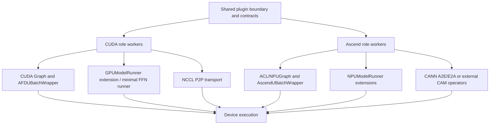

# Execution platforms

## Purpose and boundary

This document is the primary design for CUDA and NPU mechanisms: runtime
class strategy, device graphs, native DBO/ubatching, streams, forward-context
adaptation, profilers, native operators, packaging, and the tested runtime
matrix. [Attention](attention_runtime.md) and [FFN](ffn_runtime.md) retain role
lifecycle orchestration; [connector contracts](connector_contracts.md) retain
transport and topology semantics.

## Ownership and dependency direction

Platform mechanisms consume the common plugin boundary and upstream device
runtimes. They may be used by role, connector, and model modules but must not
introduce a CUDA-to-Ascend or Ascend-to-CUDA inheritance dependency.

## Runtime class strategy

CUDA and Ascend use separate internal class paths and inherit the matching
upstream runtime classes:

| Role | CUDA | Ascend |
| --- | --- | --- |
| Attention worker | `AFDAttentionWorker(Worker)` | `AFDNPUAttentionWorker(NPUWorker)` |
| Attention runner | `AFDAttentionModelRunner(GPUModelRunner)` | `AFDNPUAttentionModelRunner(NPUModelRunner)` |
| FFN worker | `AFDFFNWorker(Worker)` | `AFDNPUFFNWorker(NPUWorker)` |
| FFN runner | plugin-owned minimal `GPUFFNModelRunner` | `AFDNPUFFNModelRunner(NPUModelRunner)` |

The NPU classes do not inherit CUDA AFD classes. Shared behavior is carried
by configuration, connector payloads, forward-context metadata, graph-policy
helpers, and small role helpers. This keeps CUDA Graph assumptions out of ACL
Graph classes and keeps vLLM-Ascend lifecycle behavior visible through its own
upstream types.

Runtime modules import their real device dependencies. CPU safety applies to
the top-level package, common configuration/validation, version checks, and
the graph policy helper; importing a CUDA or Ascend runtime module requires
the corresponding runtime stack.

## Platform mechanism map

| Mechanism | CUDA owner | NPU owner |
| --- | --- | --- |
| Worker/device lifecycle | vLLM `Worker` plus AFD role worker | vLLM-Ascend `NPUWorker` plus AFD role worker |
| Attention execution | upstream `GPUModelRunner` extension | upstream `NPUModelRunner` extension |
| FFN execution | plugin minimal runner | upstream `NPUModelRunner` extension |
| Graph policy/keying | `v1/worker/cuda_graph.py` | shared policy/keying plus ACL/NPUGraph integration |
| Native ubatching | `AFDUBatchWrapper` and vLLM ubatching APIs | `AscendUBatchWrapper`, Ascend contexts, streams, and slice utilities |
| Profiling | `compat/profiler.py` | `compat/npu/profiler.py` |
| Native operators | PyTorch/vLLM CUDA runtime used by NCCL P2P | plugin CANN A2E/E2A ops or external CAM async ops |
| Build/packaging | no plugin CUDA extension | `setup.py`, `csrc/npu/**`, packaged `_cann_ops_custom` vendor tree |

## CUDA mechanisms

### Worker and device setup

Both CUDA workers call native `Worker.init_device()` and then install the
role-specific runner. `torch.accelerator.empty_cache()` releases allocations
left by replacing the native runner. Attention retains upstream model-runner
and KV-cache behavior; FFN exposes only the minimal runner surface used by the
worker/executor lifecycle.

### CUDA Graph policy

`validate_cuda_graph_mode()` resolves the shared AFD policy without importing
torch or vLLM at module import time. Current behavior is:

- `enforce_eager=true` disables graph execution;
- when graph execution is enabled, only vLLM `FULL_DECODE_ONLY` is accepted;
- Attention may use the upstream full-decode graph path;
- FFN owns a graph cache keyed by stage-indexed token-count metadata;
- native ubatching with graphs is accepted only for exactly two ubatches;
- other graph modes fail before runtime execution.

Attention treats DP metadata transfer as a control-plane side effect. For a
single-stage capture it sends the padded capture shape before entering formal
CUDA Graph capture. For an ubatched capture, `AFDUBatchWrapper` supplies the
exact stage slices and sends per-stage metadata before the graph body.

FFN uses the Attention payload's warmup/capture flags. It creates a shared
CUDA graph memory pool, uses `connector.control_plane` to update the owning
connector state before `torch.cuda.graph(...)`, captures only
model/data-plane work, and stores the graph by `make_ffn_graph_key()`. A
matching future payload replays the graph; a missing key runs eagerly.

### CUDA native ubatching

`AFDUBatchWrapper` replaces vLLM's GPU wrapper during Attention model load
when native ubatching is enabled. It:

- preserves vLLM's two-ubatch execution model;
- installs stage-local `AFDForwardContextMetadata`;
- builds the stage `additional_kwargs` and DP metadata list;
- uses padded token sizes for graph coordination while retaining unpadded
  lengths for transfer semantics;
- supports the DP-size-1 decision path that upstream normally coordinates
  only across multiple DP ranks;
- rejects a split that would produce an empty first or final stage.

The current AFD policy accepts exactly two native ubatches.

### CUDA profiling

Attention and FFN runners create separate optional `torch.profiler` instances.
They are controlled by `AFD_GPU_ATTENTION_PROFILER_*` and
`AFD_GPU_FFN_PROFILER_*` environment prefixes. Each runner advances its
profiler on execution and stops it during shutdown. `VLLM_TORCH_PROFILER_DIR`
is a fallback trace directory.

## NPU mechanisms

### NPU worker and runtime setup

NPU workers apply AFD-scoped vLLM-Ascend compatibility patches before
upstream construction. During device initialization they:

1. validate Ascend-specific feature combinations;
2. apply the non-sequence-parallel all-to-all backend correction when needed,
   including legacy explicit-worker launches;
3. reject vLLM-Ascend model runner v2;
4. call `NPUWorker._init_device()`;
5. initialize the vLLM workspace manager for one or two ubatches;
6. construct the matching `NPUModelRunner` extension.

The all-to-all correction selects `flashinfer_all2allv` when sequence
parallelism is disabled. Automatic worker selection receives the matching
upstream default-worker rewrite during config normalization; the worker-side
correction remains as a fallback for legacy explicit-worker launches.

### NPU forward context

Attention extends the upstream vLLM-Ascend forward flow and installs AFD data
in `ForwardContext.additional_kwargs`. FFN uses
`ascend_forward_context()` to create the minimal upstream context needed for
connector-driven MoE compute, including token counts and ACL graph runtime
mode when applicable.

For native ubatching, `create_ascend_forward_context()` creates one context per
stage with stage attention/DP metadata, batch descriptor, and graph mode.
Sequence-parallel intermediate tensors and DP token counts are sliced or
reassembled to match the upstream Ascend layout.

### NPU native ubatching and DBO

`AscendUBatchWrapper` is plugin-owned and deliberately separate from the CUDA
wrapper. The current path:

- supports exactly two native ubatches;
- creates one forward context and execution thread per stage;
- coordinates the threads with a barrier and paired CPU events;
- records a thread-local current NPU stream and restores the correct forward
  context after a DBO yield;
- slices input ids, positions, embeddings, intermediate tensors, and Attention
  metadata per stage;
- merges final tensors or pipeline-parallel intermediate tensors in stage
  order;
- performs TP all-gather and removes stage padding when the upstream FlashComm
  path requires it.

`v1/worker/dbo.py` registers the model-side yield operation and dispatches to
the platform DBO implementation. The optional CAM async MoE pipeline is not
this native DBO path: it is an eager, request-boundary, two-stage pipeline
owned by the model/connector flow.

### ACL Graph and NPU Graph

NPU Attention follows the upstream ACL graph dispatcher while adding AFD
metadata and control-plane coordination. `AscendUBatchWrapper` can capture or
replay the two-stage model path, stores `NPUGraph` entries by total token
count, and keeps per-stage contexts with the captured entry.

The FFN runner owns a separate ACL graph cache keyed by stage token counts and
A/F topology. Warmup runs the eager FFN path. Formal capture updates connector
state through `connector.control_plane` before entering `torch.npu.graph(...)`,
so replay contains only model and data-plane operations. An unknown key falls
back to eager execution. CAM async does not enter this path because validation
requires eager execution and `connector.control_plane` is `None`.

### Ascend native operators and packaging

`CAMP2pAFDConnector` uses plugin-owned A2E/E2A CANN operators. `setup.py`
builds the Ascend extension by default when `torch_npu`, Ascend environment
variables, or the default toolkit path identifies an Ascend environment.
`AFD_BUILD_ASCEND_OPS` explicitly enables or disables that selection, and
`AFD_SKIP_ACLNN_BUILD=1` skips the preceding ACLNN vendor build when the
artifacts already exist.

The build performs the CANN vendor build under `csrc/npu`, builds the PyTorch
CMake extension, and packages `_cann_ops_custom`. Loading remains lazy:
`ensure_cam_p2p_ops_available()` updates the vendor/library environment, imports
`afd_plugin._C_ascend`, and verifies `torch.ops.afd_ascend.a2e/e2a` only when
the connector initializes. The package can therefore be imported without the
NPU extension, but the CAMP2P data path cannot run without it.

`CAMAsyncAFDConnector` instead requires `torch_npu`, `umdk_cam_op_lib`, and the
real CAM dispatch/combine operator namespace. Its loader verifies
`async_dispatch_send`, `async_dispatch_recv`, `async_combine_send`, and
`async_combine_recv` when the connector initializes.

### NPU profiling

Attention and FFN use independent optional `torch_npu.profiler` instances,
controlled by `AFD_NPU_ATTENTION_PROFILER_*` and
`AFD_NPU_FFN_PROFILER_*`. The helper configures CPU/NPU activities, Level 2
experimental output, role-specific defaults, optional stacks/modules, and a
TensorBoard trace handler. Runners step the profiler on execution and stop it
during shutdown.

## Tested runtime matrix

This table records current validation gates and repository evidence. It is not
an expansion of the supported runtime contract.

| Platform/path | Execution | Ubatching | Routing/quantization limits | Evidence |
| --- | --- | --- | --- | --- |
| CUDA + `P2pNcclAFDConnector` | Eager or `FULL_DECODE_ONLY` CUDA Graph | Native DBO, exactly two ubatches | DeepSeek remote-experts boundary; Attention-side or FFN-side gate; EPLB rejected on the Attention remote-experts role | GPU serving, graph, TP/EP, DP/EP, DBO, profiler, model, and accuracy E2E tests |
| Ascend + `CAMP2pAFDConnector` | Eager or current ACL Graph path | Native DBO, exactly two ubatches | Common and connector-local `compute_gate_on_attention=false`; `connector_extra_config.quant_mode=0`; plugin CANN ops required | NPU serving, graph, TP, ops, profiler, model, and accuracy E2E tests |
| Ascend + `CAMAsyncAFDConnector` | Eager only | Native DBO rejected; optional async MoE ubatching uses exactly two request-boundary stages | Experimental code path; the former PCP8 recipe remains a v0.19.1rc1 historical record and was not revalidated for the v0.23 port | Unit coverage only for the retained connector/model adapters; no v0.23 hardware support claim |

The source-adapted CUDA and synchronous Ascend paths target vLLM 0.23.0 and
model runner v1. Hardware E2E validation is still required for this port.
GPU/NPU rank topology and connector resource rules remain owned by
[connector contracts](connector_contracts.md).

The repository does not record a canonical CUDA container or a released
vLLM-Ascend v0.23 container. The NPU implementation records source commit
`f042ad888`; environment evidence is not an authoritative package tag.

## Failure and cleanup boundaries

Unsupported graph, ubatch, async, gate, or quantization combinations fail in
configuration/worker/runner initialization. Missing native operators fail at
connector initialization rather than package import. Device graph caches and
profilers are runner-owned; process groups and communication handles are
connector-owned; workspace/device teardown remains upstream-owned after the
AFD role releases its resources.

## Candidate invariants

The following RFC candidate is non-normative while this document is draft:

- `PLAT-INV-001`: CUDA and Ascend AFD classes do not inherit from each other;
  platform extensions use matching upstream classes, while
  `GPUFFNModelRunner` remains a plugin-owned minimal runner.

No cross-connector graph invariant is recorded until evidence is verified on
both platforms.

## Upstream relationship and validation requirements

CUDA behavior is developed against the pinned vLLM release. The recorded
Ascend source snapshot and environment are compatibility evidence, not a
released package/tag pin. Build,
graph, profiler, and native-op changes require the matching unit and hardware
E2E paths listed above.

## Limitations and open issues

The official vLLM-Ascend v0.23 container and canonical CUDA/Ascend versus
GPU/NPU terminology are unresolved. This document uses CUDA/Ascend for backend
mechanisms and preserves GPU/NPU where it appears in public names, environment
variables, or test markers. See
[#129](https://github.com/JiusiServe/afd-plugin/issues/129).
