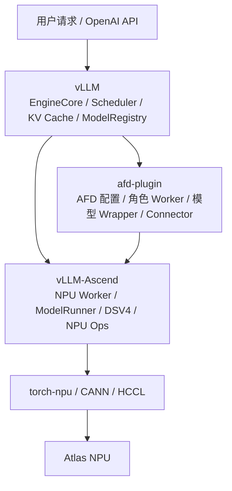
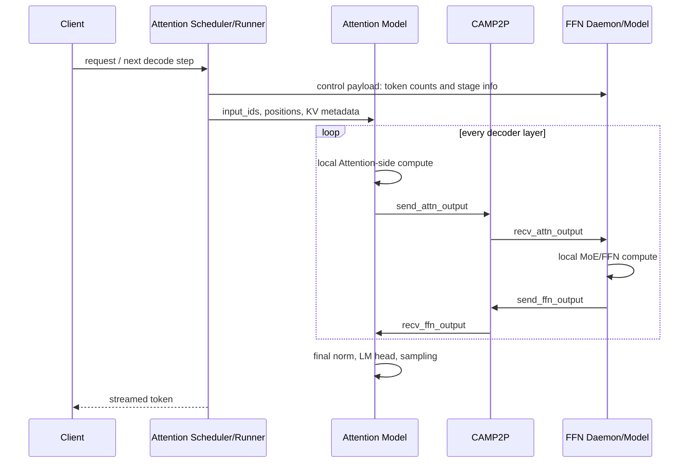

# DeepSeek V4 AFD 适配学习与实战指南

> 文档状态：适配设计与实施指南，尚不代表 DeepSeek V4 已被 afd-plugin 支持。
>
> 基线日期：2026-08-10。
>
> 适用目标：在 Atlas A3 上，以 `afd-plugin` 为唯一 AFD 扩展边界，为
> DeepSeek-V4-Flash W8A8 增加 Attention/FFN 分离，并逐步完成正确性、部署和性能优化。

## 1. 先看结论

当前固定代码基线已经具备两部分能力：

- vLLM-Ascend 本身能够加载和运行 `DeepseekV4ForCausalLM`。
- afd-plugin 已经具备 Attention/FFN 两类 worker、model runner、CAMP2P连接器、控制面、DBO/U2 和 DeepSeek V2/V3 模型 wrapper。

但这两部分还没有接起来。afd-plugin 当前没有注册`AFDDeepseekV4ForCausalLM`，也没有处理 DSV4 特有的 HC 状态和前三层 hash routing。因此，现阶段不能仅靠修改启动参数运行 DSV4 AFD。

推荐的第一版设计不是把完整 FFN 子层全部搬到 FFN 节点，而是沿用 plugin现有的“远程 MoE/experts 边界”：

```text
Attention 节点：HC-Attention + Attention + HC-FFN-pre + FFN Norm
                                      |
                                      | [tokens, 4096]
                                      v
FFN 节点：                         MoE experts
                                      |
                                      | [tokens, 4096]
                                      v
Attention 节点：                  HC-FFN-post
```

这样做有三个直接收益：

1. 继续满足现有 CAMP2P 的二维 `[tokens, hidden_size]` 数据契约。
2. 不需要每层往返传输 `[tokens, 4, 4096]` 的 HC 状态，逻辑通信量降低为完整 FFN 拆分方案的四分之一。
3. 与 afd-plugin 已有 DeepSeek wrapper 的远程 experts 抽象一致，改动范围更小。

第一版建议严格限制为：

```text
CAMP2pAFDConnector
A8F8，一对一映射
Attention TP1 / FFN TP1
eager
UBatch1
无 MTP/投机解码
无 PD/Mooncake
无 PP、CP、sequence-parallel MoE
```

先完成“数学结果正确、模型只加载本角色权重、服务能稳定运行”，再依次增加ACL Graph、DBO/U2、PD 和性能优化。不要在第一版同时调试这些功能。

## 2. 固定版本与代码位置

本文所有源码解释均针对下表中的固定版本，不应直接套用到其他版本。

| 组件 | 位置 | 版本 |
| --- | --- | --- |
| afd-plugin | 当前仓库 | `main@a3fa2c7` |
| vLLM | `../../../vllm-afd-v0.26.0` | `v0.26.0@568afb3a1` |
| vLLM-Ascend | `../../../vllm-ascend-afd-80d8c194f` | `80d8c194f` |
| 模型 | `../../../../models/DeepSeek-V4-Flash-w8a8-mtp` | DeepSeek-V4-Flash W8A8 + MTP 权重 |

NPU 软件栈以固定 vLLM-Ascend 快照的[安装要求](../../../vllm-ascend-afd-80d8c194f/docs/source/installation.md)为准：

| 组件 | 建议值 |
| --- | --- |
| Python | 3.11 |
| CANN / NNAL | 9.0.1 |
| torch | 2.10.0 |
| torch-npu | 2.10.0.post2 |
| transformers | 5.14.1 |

当前 shell 若使用 CANN 9.1.0，不能把它和这套 9.0.1 基线混在同一个 Python环境中。vLLM 自身的通用构建依赖与 vLLM-Ascend 的 NPU 依赖可能不同，NPU环境应以 vLLM-Ascend 的锁定版本为准，并用 `--no-deps` 防止安装 plugin 时覆盖torch/torch-npu。

### 2.1 源码快速导航

阅读时优先搜索类名或函数名，不要依赖本文记录的行号；代码继续演进后行号会变化，符号名更稳定。

| 想回答的问题 | 搜索符号 | 源码 |
| --- | --- | --- |
| plugin 在哪里注册模型 | `register_afd`、`_DEEPSEEK_MODEL_REGISTRATIONS` | [`afd_plugin/__init__.py`](../../afd_plugin/__init__.py) |
| `additional-config` 如何选 worker | `_select_afd_worker_for_auto` | [`config_validation.py`](../../afd_plugin/compat/patches/config_validation.py) |
| 普通 architecture 如何改成 AFD architecture | `get_afd_model_config` | [`model_utils.py`](../../afd_plugin/model_executor/models/model_utils.py) |
| Attention runner 如何注入 AFD 上下文 | `_install_afd_metadata_on_forward_context` | [`attention_model_runner.py`](../../afd_plugin/v1/worker/npu/attention_model_runner.py) |
| Attention layer 如何发起远程 FFN | `RemoteFFNProxy._send_and_receive` | [`deepseek_v2.py`](../../afd_plugin/model_executor/models/deepseek_v2.py) |
| FFN 后台线程如何被驱动 | `_run_ffn_server_loop` | [`ffn_worker.py`](../../afd_plugin/v1/worker/npu/ffn_worker.py) |
| FFN 如何逐层 receive/compute/send | `AFDNPUFFNModelRunner._ffn_forward` | [`ffn_model_runner.py`](../../afd_plugin/v1/worker/npu/ffn_model_runner.py) |
| CAMP2P 四个数据面动作 | `send_attn_output`、`recv_attn_output`、`send_ffn_output`、`recv_ffn_output` | [`camp2p.py`](../../afd_plugin/connectors/npu/camp2p.py) |
| DSV4 HC 层如何计算 | `DeepseekV2DecoderLayer.forward` | 固定上游 [`deepseek_v4.py`](../../../vllm-ascend-afd-80d8c194f/vllm_ascend/models/deepseek_v4.py) |
| DSV4 hash routing 如何取 token IDs | `_select_experts_with_fusion_ops` | 固定上游 [`experts_selector.py`](../../../vllm-ascend-afd-80d8c194f/vllm_ascend/ops/fused_moe/experts_selector.py) |

在仓库根目录可以直接执行：

```bash
rg -n 'def register_afd|def get_afd_model_config' afd_plugin
rg -n 'class RemoteFFNProxy|def _send_and_receive|def compute_ffn_output' \
  afd_plugin/model_executor/models/deepseek_v2.py
rg -n 'def _run_ffn_server_loop|def _ffn_forward' afd_plugin/v1/worker/npu
rg -n 'def (send_attn_output|recv_attn_output|send_ffn_output|recv_ffn_output)' \
  afd_plugin/connectors/npu/camp2p.py
rg -n 'class DeepseekV2DecoderLayer|def hc_pre|def hc_post' \
  ../vllm-ascend-afd-80d8c194f/vllm_ascend/models/deepseek_v4.py
```

注意，固定上游 DSV4 文件中的 decoder layer 类仍名为`DeepseekV2DecoderLayer`。这是源码真实命名，不代表它执行的是 DSV2 数学；适配时不要因为类名而误读调用链。

### 2.2 vLLM、vLLM-Ascend 与 afd-plugin 的关系

三者不是三个并列的推理服务，而是逐层扩展的依赖关系：vLLM 提供通用推理框架，vLLM-Ascend 把框架落到昇腾 NPU，afd-plugin 再在前两者之上增加 Attention/FFN分离能力。



从依赖方向看：

```text
vLLM-Ascend ----依赖----> vLLM
afd-plugin  ----依赖----> vLLM
afd-plugin 的 NPU 路径 --> vLLM-Ascend

vLLM 不依赖 afd-plugin
vLLM-Ascend 不依赖 afd-plugin
```

#### vLLM：通用推理主框架

vLLM 负责硬件无关的主要推理生命周期：

- OpenAI API Server、tokenizer 和流式响应。
- EngineCore、Scheduler 和动态 batching。
- Prefill/Decode 请求状态管理。
- KV Cache 的通用接口和 block 调度。
- Worker、ModelRunner、ModelRegistry 等扩展接口。
- logits、sampling 以及 DP/TP/PP 等通用配置。

可以把 vLLM 理解为“控制一轮推理何时执行、执行哪些 token”的主框架。它定义接口，但不会自行实现 Atlas NPU 上的 MLA、HC、FusedMoE、ACL Graph 等细节。

#### vLLM-Ascend：vLLM 的昇腾平台与执行后端

固定 vLLM-Ascend 通过 platform/general plugin entry points 接入 vLLM，其中核心的platform entry point 是：

```python
# vllm-ascend setup.py
"vllm.platform_plugins": ["ascend = vllm_ascend:register"]
```

它主要提供：

- Ascend platform、`NPUWorker` 和 `NPUModelRunner`。
- NPU Attention、MLA/DSA、KV Cache backend。
- Ascend FusedMoE、EP/MC2/HCCL 通信。
- W8A8 等量化方法和原生权重加载。
- ACL Graph、NPU forward context 和相关 custom ops。
- `AscendDeepseekV4ForCausalLM`、HC 算子及 hash routing。

所以，不启用 AFD 时的 DSV4 路径是：

```text
vLLM Scheduler
  -> vLLM-Ascend NPUWorker
  -> NPUModelRunner
  -> AscendDeepseekV4ForCausalLM
  -> 每个 rank 在本地执行完整 Attention + MoE
```

#### afd-plugin：AF 分离功能扩展

afd-plugin 通过另一个 entry point 被 vLLM 发现：

```toml
# afd-plugin pyproject.toml
[project.entry-points."vllm.general_plugins"]
afd = "afd_plugin:register_afd"
```

它不重新实现完整的 vLLM 调度器或全部 Ascend 模型算子，而是负责改变模型的部署和调用方式：

- 解析 `additional_config["afd"]` 和 `role`。
- 选择 Attention/FFN 专用 worker 与 model runner。
- 把普通 architecture 改写为 `AFD...ForCausalLM`。
- 按角色构造模块并过滤 checkpoint 权重。
- Attention 侧保留 scheduler、KV Cache、Attention、LM head 和 sampling。
- FFN 侧运行 connector-driven daemon 和 MoE/experts。
- 用 Gloo 传控制信息，用 CAMP2P/HCCL 传 hidden states。

启用 AFD 后的目标路径是：

```text
vLLM Scheduler
  -> afd-plugin Attention Worker
  -> vLLM-Ascend DSV4 Attention + HC
  -> afd-plugin CAMP2P [T,4096]
  -> afd-plugin FFN Worker
  -> vLLM-Ascend DeepseekV4MoE
  -> afd-plugin CAMP2P [T,4096]
  -> Attention 继续下一层，最后由 vLLM 完成 sampling
```

职责边界如下：

| 能力 | vLLM | vLLM-Ascend | afd-plugin |
| --- | :---: | :---: | :---: |
| HTTP、调度、sampling | 主实现 | 适配所需接口 | 复用 |
| Worker/ModelRunner | 定义通用框架 | 实现 NPU 版本 | 派生 A/F 角色版本 |
| KV Cache | 定义和调度 | NPU backend | 只在 Attention 角色使用 |
| DSV4 模型数学 | 模型接口 | 完整原生实现 | 角色化包装 |
| HC、MLA、MoE NPU 算子 | 无 | 实现 | 复用并决定执行位置 |
| W8A8 权重加载 | 通用 loader 框架 | DSV4/NPU 具体实现 | 按角色过滤后复用 |
| AF 拆分 | 无 | 无 | 核心职责 |
| Gloo/CAMP2P 协议 | 分布式基础能力 | HCCL/NPU 基础能力 | 定义并组织 A/F 流程 |

#### DSV4 适配为什么主要修改 afd-plugin

固定 vLLM-Ascend 已能运行未拆分的完整 DSV4，已经拥有 HC、Attention、MoE、hash routing 和 W8A8 loader。当前缺失的是“如何把这些模块按 Attention/FFN 角色部署”，这正是 afd-plugin 的职责。

因此本项目的适配原则是：

1. 不修改 vLLM 的调度核心。
2. 尽量不修改固定 vLLM-Ascend 源码。
3. 在 afd-plugin 新增 `AFDDeepseekV4ForCausalLM` 和角色化 decoder/model。
4. 继承或组合 vLLM-Ascend 的原生 DSV4 类，复用 HC、MoE 和 W8A8 loader。
5. 只新增角色化构建、权重过滤、HC 拆分边界及 input IDs/CAMP2P 通信。

afd-plugin 中确实包含少量固定版本 compatibility patch，但它们应保持窄范围，并用于适配既有接口，而不是把 vLLM 或 vLLM-Ascend 复制进 plugin。

#### 为什么版本必须成套固定

vLLM-Ascend 依赖 vLLM 的 Worker、ModelRunner、ForwardContext、ModelRegistry 和编译接口；afd-plugin 又同时依赖 vLLM 与 vLLM-Ascend 的这些签名和行为。任意升级其中一个组件，都可能导致：

- Python 函数签名或类路径变化。
- forward context 字段变化。
- model loader/checkpoint key 映射变化。
- custom op、torch-npu 或 CANN ABI 不兼容。
- graph/DBO/通信顺序发生变化。

运行时用：

```bash
export VLLM_PLUGINS=ascend,afd
```

表示让 vLLM 同时发现 Ascend 平台能力和 AFD 功能扩展；它不能解决版本不匹配问题，仍必须使用本节开头固定的整套版本。

## 3. 必须先理解的概念

### 3.1 一次推理请求在 vLLM 中经过什么

可以先把 vLLM 理解为“持续把很多请求的 token 重新组批并送进模型”的运行时：


- API Server 负责 HTTP、tokenizer 和流式响应。
- Scheduler 决定本轮哪些请求各执行多少 token，并形成一个动态 batch。
- Worker 管理设备、分布式组、KV Cache 和 model runner。
- ModelRunner 把调度结果变成 `input_ids`、`positions`、attention metadata 等
  NPU tensor，并设置 forward context。
- Model 执行所有 Transformer 层。
- 最后一层输出经过 LM head 和 sampler 产生下一个 token，再回到下一轮调度。

这里的一个“step”不一定对应一个请求。它通常包含多个请求本轮需要执行的所有token。AFD 的通信大小因此取决于本 step 的 token 数，而不仅是请求数。

### 3.2 Prefill 与 Decode

| 阶段 | 行为 | 常见特征 |
| --- | --- | --- |
| Prefill | 一次处理 prompt 的多个 token，建立 KV Cache | token 多、Attention 计算重 |
| Decode | 每个活跃序列通常生成一个新 token | 单步 token 少、执行步数多、调度和通信固定开销敏感 |

AFD 主要解决 Decode 中 Attention 与 MoE FFN 的资源需求不同、扩缩容比例不同的问题。它不是 PD 分离：

- PD 分离是在请求生命周期上拆 Prefill 和 Decode。
- AF 分离是在 Decode 的每一层内部拆 Attention 和 FFN/MoE。
- 两者可以叠加，但应先分别验证。

### 3.3 DP、TP、EP 分别是什么

| 并行方式 | 拆分对象 | 对 AFD 的影响 |
| --- | --- | --- |
| DP，Data Parallel | 不同请求/batch | 每个 DP rank 有不同 token，AFD role rank 通常由 DP rank 派生 |
| TP，Tensor Parallel | 同一个算子的张量维度 | 同一 token 在多个 TP rank 协作，影响 role rank 和张量布局 |
| EP，Expert Parallel | MoE experts | FFN 侧把 256 个 routed experts 分布到多个 rank |

初版使用 A8F8、两侧 TP1，意味着 Attention rank `Ai` 和 FFN rank `Fi`一一对应；FFN 的 8 个 rank 同时组成 EP group。这个拓扑最容易证明 input IDs 与hidden states 的顺序一致。

### 3.4 MoE 中 gate、router 和 experts

普通 FFN 对每个 token 使用同一组权重。MoE 先做路由，再只调用部分专家：

```text
hidden_states
    -> gate/router
    -> top-k expert IDs + top-k weights
    -> token dispatch/all-to-all
    -> selected experts
    -> combine
    -> FFN output
```

DSV4 的 `num_experts_per_tok=6`，即每个 token 选择 6 个 routed experts；此外还有 1 个 shared expert。

### 3.5 数据面、控制面和业务面

这三个“面”不要混淆：

| 通道 | 传输内容 | 当前实现 |
| --- | --- | --- |
| 业务面 | HTTP 请求、流式 token | 只访问 Attention API |
| 控制面 | 每个 DP/ubatch 的 token 数、graph/warmup 标志 | Gloo，`AFDControlPayload` |
| 数据面 | 每层 Attention 到 FFN 的 hidden states 和返回值 | HCCL/CAMP2P custom ops |

AFD `host/port` 是 connector rendezvous/control 地址，不是业务 HTTP 端口，也不是Mooncake KV 传输端口。

### 3.6 DBO、UBatch 和 Graph

- DBO 把一个可拆分 batch 切成两个 ubatch，让一个 ubatch 的通信/FFN 有机会与另一个 ubatch 的 Attention 重叠。
- 当前 plugin 的同步 NPU 路径只支持恰好两个 ubatch。
- `FULL_DECODE_ONLY` 把稳定的 Decode shape 捕获成 ACL Graph，减少 Python 和  kernel launch 开销。
- eager 最容易调试动态 shape 和通信顺序，所以必须先用 eager/U1 建立正确性基线。

## 4. afd-plugin 启动流程

### 4.1 Plugin 如何被 vLLM 发现

安装包在 `pyproject.toml` 中注册：

```text
[project.entry-points."vllm.general_plugins"]
afd = "afd_plugin:register_afd"
```

vLLM 启动时调用 [`register_afd()`](../../afd_plugin/__init__.py)，主要完成：

1. 检查目标 vLLM 版本。
2. 加载少量、固定版本的兼容 patch。
3. 注册 DBO yield custom op。
4. 向 vLLM `ModelRegistry` 注册 `AFD...ForCausalLM` 模型名。

当前注册表只有 DeepSeek V2/V3/V3.2 和 GLM MoE DSA，没有 DSV4。这是适配要改的第一个入口。

### 4.2 `--additional-config` 如何激活 AFD

AFD 的唯一标准配置入口是：

```json
{
  "afd": {
    "role": "attention",
    "connector": "CAMP2pAFDConnector",
    "host": "127.0.0.1",
    "port": 6239,
    "num_attention_ranks": 8,
    "num_ffn_ranks": 8,
    "compute_gate_on_attention": false,
    "connector_extra_config": {
      "core_num": 8,
      "quant_mode": 0
    }
  }
}
```

`additional_config["afd"]` 的存在就是激活信号。配置解析和公共校验位于[`config.py`](../../afd_plugin/config.py)。旧代码中的 `--afd-config` 和`afd_size=8N8` 不是 plugin `v0.26` 的启动接口。

### 4.3 Worker 为什么会自动变成 Attention 或 FFN

配置构建 patch 会在 `worker_cls="auto"` 时，根据 platform 和 `afd.role` 选择：

| role | Ascend worker |
| --- | --- |
| attention | `AFDNPUAttentionWorker` |
| ffn | `AFDNPUFFNWorker` |

所以新启动命令不应显式依赖内部 worker class path。相关代码在[`config_validation.py`](../../afd_plugin/compat/patches/config_validation.py)和 [`validation.py`](../../afd_plugin/validation.py)。

### 4.4 普通模型名为什么会变成 AFD 模型名

checkpoint 的 `config.json` 写的是：

```json
{"architectures": ["DeepseekV4ForCausalLM"]}
```

AFD worker 初始化时调用[`get_afd_model_config()`](../../afd_plugin/model_executor/models/model_utils.py)，深拷贝 `ModelConfig` 并把 architecture 改为：

```text
AFDDeepseekV4ForCausalLM
```

vLLM 的 `ModelRegistry` 随后加载 plugin 自己的 wrapper，而不是直接加载普通`AscendDeepseekV4ForCausalLM`。因此 DSV4 适配应放在 afd-plugin 内，不应修改vLLM 或 vLLM-Ascend 源码。

### 4.5 启动流程的关键代码串联

下面的代码均为当前仓库真实逻辑的精简摘录。按编号阅读，可以看到一个启动参数如何最终决定设备上构造哪个模型类。

第一步，vLLM 调用 plugin entry point，plugin 把带 `AFD` 前缀的 architecture 注册到`ModelRegistry`。当前映射中还没有 DSV4，适配后需要增加对应项：

```python
# afd_plugin/__init__.py
_DEEPSEEK_MODEL_REGISTRATIONS = {
    "DeepseekV2ForCausalLM": (
        "afd_plugin.model_executor.models.deepseek_v2:AFDDeepseekV2ForCausalLM"
    ),
    # DSV4 适配完成后新增：
    # "DeepseekV4ForCausalLM": (
    #     "afd_plugin.model_executor.models.deepseek_v4:AFDDeepseekV4ForCausalLM"
    # ),
}

def register_afd() -> None:
    from vllm.model_executor.models import ModelRegistry

    for model_arch, model_cls in _DEEPSEEK_MODEL_REGISTRATIONS.items():
        ModelRegistry.register_model(f"AFD{model_arch}", model_cls)
```

第二步，配置 patch 只在用户保留 `worker_cls="auto"` 时，根据`additional_config["afd"]["role"]` 选择角色 worker：

```python
# afd_plugin/compat/patches/config_validation.py
def _select_afd_worker_for_auto(vllm_config: VllmConfig) -> None:
    afd_config = parse_optional_afd_config(vllm_config)
    if afd_config is None:
        return

    vllm_config.parallel_config.worker_cls = (
        afd_worker_qualname_for_platform_default(
            afd_config.role,
            vllm_config.parallel_config.worker_cls,
            is_cuda=current_platform.is_cuda(),
            device_type=current_platform.device_type,
        )
    )
```

第三步，Attention 和 FFN worker 在创建 model runner 前都调用`get_afd_model_config()`。它深拷贝配置并给 architecture 加 `AFD` 前缀：

```python
# afd_plugin/model_executor/models/model_utils.py
def get_afd_model_config(model_config: ModelConfig) -> ModelConfig:
    for model_arch in model_config.hf_config.architectures:
        if model_arch in _DEEPSEEK_MODEL_REGISTRATIONS:
            afd_model_config = deepcopy(model_config)
            afd_model_config.hf_config.architectures = [f"AFD{model_arch}"]
            return afd_model_config
    return model_config
```

因此 DSV4 的完整解析链应为：

```text
config.json: DeepseekV4ForCausalLM
  -> additional_config.afd.role 选择 AFDNPUAttentionWorker 或 AFDNPUFFNWorker
  -> get_afd_model_config() 改为 AFDDeepseekV4ForCausalLM
  -> ModelRegistry 找到 afd_plugin.model_executor.models.deepseek_v4
  -> wrapper 根据同一个 role 只构造并加载本角色模块
```

若启动日志显示 worker 已经是 AFD worker，但模型仍解析成普通`DeepseekV4ForCausalLM`，应先检查注册映射和 `get_afd_model_config()`，而不是调CAMP2P。

## 5. afd-plugin 运行时业务流程

### 5.1 Attention 角色

[`AFDNPUAttentionWorker`](../../afd_plugin/v1/worker/npu/attention_worker.py)仍然接收 scheduler 的 `execute_model()`：

1. 初始化 NPU、AFD model runner 和 connector。
2. 按 Attention 角色加载模型。
3. scheduler 每产生一个 step，就准备 `input_ids`、`positions`、KV metadata。
4. runner 把 AFD metadata 注入当前 `ForwardContext.additional_kwargs`。
5. 模型 wrapper 在每一层调用 connector 完成 A2F/F2A 往返。
6. 所有层完成后，在 Attention 侧做 LM head、logits 和 sampling。

Attention 侧持有 KV Cache，因为只有 Attention 计算需要历史 K/V。业务请求也只发给Attention API。

### 5.2 FFN 角色

[`AFDNPUFFNWorker`](../../afd_plugin/v1/worker/npu/ffn_worker.py)不是另一个正常推理服务。它有以下特点：

- `get_kv_cache_spec()` 返回空，FFN 不分配 KV Cache。
- scheduler 驱动的 `execute_model()` 会直接报错。
- 初始化后启动后台 daemon loop。
- daemon 先从控制面接收本 step 的 token metadata，再逐层从 connector 收数据、执行 FFN/MoE、把结果发回 Attention。

所以 FFN 进程可以由 `vllm serve` 形式拉起，但它不是业务 API，不要把健康检查或请求流量发到它的 CLI placeholder 端口。

### 5.3 CAMP2P 的控制面

Attention runner 将每个 stage/ubatch 的 DP token 数封装为[`AFDControlPayload`](../../afd_plugin/connectors/metadata.py)，通过 Gloo 发给 FFN。
FFN 根据这些数字预先知道下一次 A2E receive 应分配/使用多大的 tensor。

#### Gloo 是什么

Gloo 是 PyTorch Distributed 提供的一种通信 backend，适合不同进程或节点之间交换
CPU tensor 和小型控制信息。它不是 HTTP 服务，也不是模型算子，更不是 NPU 上的
大张量通信协议。

在 afd-plugin 中，Gloo 专门承担控制面：Attention 先告诉 FFN“这个 step 的每个
stage 有多少 token、当前是否在 graph capture/warmup”，FFN 得到这些信息后才能为
下一次 CAMP2P A2E receive 确定 tensor 大小和执行模式。

```text
Attention                                      FFN
    |                                           |
    |-- Gloo: token counts / graph flags ------>|  准备 shape 和状态
    |                                           |
    |-- HCCL/CAMP2P: hidden [T,4096] ---------->|  执行 MoE
    |<---------- HCCL/CAMP2P: output [T,4096] --|
```

三类通道的职责必须分开：

| 通道 | 当前传输内容 | 数据位置 | 特点 |
| --- | --- | --- | --- |
| HTTP | 用户请求、流式生成结果 | 主机网络 | 业务面，只访问 Attention API |
| Gloo | token 数、stage、graph/warmup 标志 | CPU | 控制面，消息小且结构灵活 |
| HCCL/CAMP2P | hidden states、MoE output | NPU | 数据面，面向高吞吐设备 tensor |

当前 connector 创建 Gloo group 的关键代码是：

```python
# afd_plugin/connectors/npu/camp2p.py
if self.topology.participates_in_p2p_group:
    self.p2p_pg = init_afd_process_group(
        backend="gloo",
        init_method=f"tcp://{self.afd_config.host}:{self.afd_config.port}",
        world_size=self.topology.p2p_world_size,
        rank=self.p2p_rank,
        group_name="p2p",
        timeout=timedelta(minutes=30),
    )
```

这里的 `ProcessGroup` 可以理解为“一组按 rank 编号、必须遵守相同通信顺序的进程”。
A8F8 时，8 个 FFN rank 和 8 个 Attention rank 都加入 Gloo group；A 大于 F 时，所有
FFN rank 与前 `min(A,F)` 个 Attention rank 加入控制组，由这些 Attention rank 分发
对应 DP metadata。

`CAMP2pAFDControlPlane` 明确把 wire tensor 放在 CPU：

```python
# Attention
send_control_payload(
    payload,
    dst=connector.dst_list,
    group=connector.p2p_pg,
    device=torch.device("cpu"),
)

# FFN
payload = recv_control_payload(
    src=src,
    group=connector.p2p_pg,
    device=torch.device("cpu"),
)
```

payload 会先编码成精简 JSON bytes，再作为 `uint8` CPU tensor 发送。当前 wire schema
只包含：

```text
dp_metadata_list[stage].num_tokens_across_dp_cpu
dp_metadata_list[stage].max_tokens_across_dp_cpu
is_graph_capturing
is_warmup
```

发送时实际是两条 Gloo 消息：先发送长度 tensor，再发送对应的 `uint8` 内容 tensor。
因此 Gloo 适合这类小型元数据，但不应承载每层 `[T,4096]` hidden states，也不应把
DSV4 的整个 `input_ids` tensor 编码进控制 JSON；它们需要 NPU/HCCL 数据通道。

同步 AFD 的顺序是确定的：

```text
Attention: 发送 step metadata -> layer 0 -> layer 1 -> ... -> layer 42
FFN:       接收 step metadata -> layer 0 -> layer 1 -> ... -> layer 42
```

控制面不应传大 tensor。它适合传 shape、状态和小型标识，不适合把整个 `input_ids`编码成 JSON。

部署时通常要明确指定 Gloo 使用的网卡：

```bash
export GLOO_SOCKET_IFNAME="${NIC_NAME}"
```

如果服务卡在 Gloo 初始化或 FFN 一直收不到 metadata，按下面顺序排查：

1. 两侧 `afd.host`、`afd.port`、Attention/FFN rank 数是否完全一致。
2. `GLOO_SOCKET_IFNAME` 是否为两侧互通的真实网卡，而不是 loopback 或错误管理网卡。
3. host/port 是否可达，端口是否被旧进程占用或被防火墙拦截。
4. 两侧参与 Gloo group 的进程是否全部启动，`p2p_rank/world_size` 是否一致。
5. Attention 是否执行了 `_send_dp_metadata()`，FFN 是否阻塞在
   `recv_dp_metadata_list()`。

一句话记忆：**Gloo 先告诉 FFN“接下来收多少数据”，HCCL/CAMP2P 再真正搬运这些
数据。**

### 5.4 CAMP2P 的数据面

[`CAMP2pAFDConnector`](../../afd_plugin/connectors/npu/camp2p.py)每层执行：

```text
Attention send_attn_output(hidden)
FFN       recv_attn_output() -> AFDA2FTransferPayload
FFN       compute_ffn_output(hidden)
FFN       send_ffn_output(output)
Attention recv_ffn_output(ref_tensor)
```

其当前 tensor 契约是 `[tokens, hidden_size]`，并把 `hidden_size` 直接设置为 HF config 的 `4096`。CAMP2P 还会创建：

- 每个 batch/ubatch 一个 AFD HCCL process group。
- 一个 FFN-only HCCL group，供 MoE 路径使用。
- 一个 Gloo control group，传 DP metadata。

对于 A8F8，联合 world rank 的逻辑排列为：

```text
F0 F1 F2 F3 F4 F5 F6 F7 A0 A1 A2 A3 A4 A5 A6 A7
|  |  |  |  |  |  |  |  |  |  |  |  |  |  |  |
+--+--+--+--+--+--+--+-- 对应一一配对 --+--+--+--+
```

更准确地说是 `Fi <-> Ai`。A 大于 F 时一个 FFN 会 fan-in 多个 Attention rank，input IDs 必须按 A2E hidden states 完全相同的顺序拼接；第一版限定 A8F8 可以暂时避开这个额外契约。

### 5.5 一次 Decode step 的时序

下图先展示现有 plugin 的通用流程。DSV4 推荐边界在第 7 节进一步细化。



### 5.6 一层 AFD 往返对应的关键代码

这一节把上面的时序图映射到当前 plugin 的真实代码。片段省略了 graph、DBO 和异常处理，只用于快速建立调用链；完整行为以链接源码为准。

第一步，Attention runner 在调用模型前，把 connector 和当前 step/stage 信息放入`ForwardContext.additional_kwargs`。模型层不直接依赖 runner，而是从 forward context 取出这些信息：

```python
# afd_plugin/v1/worker/npu/attention_model_runner.py
def _model_forward(self, ..., input_ids=None, positions=None, ...):
    forward_context = get_forward_context()
    self._install_afd_metadata_on_forward_context(forward_context)

    model_inputs = {
        "input_ids": input_ids,
        "positions": positions,
        ...
    }
    return self.model(**model_inputs)

def _install_afd_metadata_on_forward_context(self, forward_context):
    if self._afd_pending_metadata is None:
        self._afd_pending_metadata = self._build_afd_metadata(...)
    forward_context.additional_kwargs["afd_metadata"] = (
        self._afd_pending_metadata
    )
    self._send_dp_metadata(forward_context.dp_metadata, ...)
```

第二步，现有 DeepSeek V2/V3 wrapper 中的参数为空代理负责一次 A2F/F2A 往返。
DSV4 推荐继续复用这个抽象，只是调用位置改为 FFN 的 `hc_pre + norm` 之后：

```python
# afd_plugin/model_executor/models/deepseek_v2.py
class RemoteFFNProxy(nn.Module):
    def _send_and_receive(self, hidden_states, **send_kwargs):
        afd_metadata = get_afd_metadata_from_forward_context()
        stage_idx = int(getattr(
            get_forward_context(), "ubatch_idx", afd_metadata.stage_idx
        ))
        metadata = AFDTransferMetadata.create_attention_metadata(
            layer_idx=self.layer_idx,
            stage_idx=stage_idx,
            seq_len=int(hidden_states.shape[0]),
        )
        context = AFDTransferContext(metadata=metadata)
        afd_metadata.connector.send_attn_output(
            hidden_states, context, **send_kwargs
        )
        return afd_metadata.connector.recv_ffn_output(
            ref_tensor=hidden_states,
            ubatch_idx=stage_idx,
        )
```

这里 `ref_tensor=hidden_states` 不表示跳过通信。它为 receive 提供期望的 shape、dtype和稳定 storage，对 graph capture 也很重要。

第三步，FFN worker 没有业务 scheduler。后台线程先收控制面 payload，再让 runner执行完整的 43 层 FFN step：

```python
# afd_plugin/v1/worker/npu/ffn_worker.py
def _run_ffn_server_loop(self) -> None:
    while not self._ffn_shutdown_event.is_set():
        payload = self.model_runner.connector.control_plane.recv_dp_metadata_list()
        self.model_runner.execute_ffn_step(
            dp_metadata_list=payload.dp_metadata_list,
            is_graph_capturing=payload.is_graph_capturing,
            is_warmup=payload.is_warmup,
        )
        torch.npu.synchronize()
```

第四步，FFN runner 的关键循环顺序是 `layer -> stage`。每次 receive 得到的`context` 必须原样带到 send，CAMP2P 会在其中保存返程所需状态：

```python
# afd_plugin/v1/worker/npu/ffn_model_runner.py
for layer_idx in _ffn_layer_indices(self):
    for stage_idx in stage_ids:
        with ascend_forward_context(...) as forward_context:
            payload = self.connector.recv_attn_output(
                ubatch_idx=stage_idx,
                layer_idx=layer_idx,
                max_num_tokens=self.max_num_tokens,
            )
            hidden_states = payload.hidden_states
            context = payload.context
            _set_moe_layer_index(forward_context, layer_idx)

            ffn_output = self.model.compute_ffn_output(
                hidden_states=hidden_states,
                layer_idx=layer_idx,
            )
            self.connector.send_ffn_output(
                ffn_output,
                context,
                ubatch_idx=stage_idx,
            )
```

第五步，模型 wrapper 只按 `layer_idx` 找到本层 MoE。现有 wrapper 的这两层透传是DSV4 `compute_ffn_output()` 最直接的参考：

```python
# afd_plugin/model_executor/models/deepseek_v2.py
class AFDDeepseekV2Model(...):
    def compute_ffn_output(self, hidden_states, layer_idx, **kwargs):
        return self.layers[layer_idx].compute_ffn_output(
            hidden_states, **kwargs
        )

class AFDDeepseekV2ForCausalLM(...):
    def compute_ffn_output(self, hidden_states, layer_idx, **kwargs):
        return self.model.compute_ffn_output(
            hidden_states, layer_idx, **kwargs
        )
```

最后，CAMP2P Python 方法和底层 op 的对应关系如下：

| 角色动作 | Python 方法 | 关键底层 op |
| --- | --- | --- |
| Attention 发送 | `send_attn_output()` | `torch.ops.vllm.afd_camp2p_send_attn_output` |
| FFN 接收 | `recv_attn_output()` | `torch.ops.afd_ascend.a2e` |
| FFN 返回 | `send_ffn_output()` | `torch.ops.afd_ascend.e2a` |
| Attention 接收 | `recv_ffn_output()` | `torch.ops.vllm.afd_camp2p_recv_ffn_output` |

调试一层超时或 shape 错误时，按这五步从前往后加日志：不要一开始进入 C++/CANN算子。先确认两侧 `layer_idx`、`stage_idx`、token 数、dtype 和调用次数完全一致。

## 6. DeepSeek V4 模型结构

### 6.1 当前模型的关键配置

当前模型 [`config.json`](../../../../models/DeepSeek-V4-Flash-w8a8-mtp/config.json)
包含：

| 参数 | 值 | 对 AFD 的意义 |
| --- | ---: | --- |
| `num_hidden_layers` | 43 | 每个 step 有 43 次 A2F/F2A 往返 |
| `hidden_size` | 4096 | 推荐通信 tensor 的最后一维 |
| `hc_mult` | 4 | 层间 HC residual 状态为四路 |
| `num_hash_layers` | 3 | 前三层路由需要 token IDs |
| `n_routed_experts` | 256 | FFN 侧 EP 分布的 routed experts |
| `n_shared_experts` | 1 | FFN 侧还需 shared expert |
| `num_experts_per_tok` | 6 | 每 token top-k=6 |
| `num_nextn_predict_layers` | 1 | checkpoint 带 MTP，但初版禁用 |
| quantization | W8A8 dynamic | 必须保留 scale/offset 的原生加载逻辑 |

### 6.2 HC 是什么

这里所说的“HC 状态”不是 KV Cache，不是 token IDs，也不是模型权重。它是 DSV4在相邻 Transformer 层之间持续传递的多路 residual hidden state。

普通 Transformer 对每个 token 只维护一条 residual stream：

```text
hidden_states: [tokens, hidden_size] = [T, 4096]
```

DSV4 不再只维护一条 `[T, H]` residual stream，而是通过 `hc_mult=4` 为每个token 维护 4 条可混合的 residual stream：

```text
HC state: [tokens, hc_mult, hidden_size] = [T, 4, 4096]
```

其中：

```text
T = 当前 step/ubatch 的 token 数
C = hc_mult = 4
H = hidden_size = 4096
```

可以把它理解成：普通 Transformer 只有一条层间“主干状态”，DSV4 同时维护四条主干状态，并在 Attention、FFN 前后根据可学习参数动态混合。

`hc_pre` 不是简单的 reshape。它使用 `hc_*_fn/base/scale` 参数，从四路 HC state中组合出当前 Attention 或 FFN 要消费的二维表示，同时产生本次更新需要的临时混合信息：

```python
sublayer_input, post, comb = hc_pre(
    hc_state,
    hc_fn,
    hc_scale,
    hc_base,
)
```

这些对象的职责不同：

| 数据 | 典型生命周期 | 作用 |
| --- | --- | --- |
| `hc_state` / residual | 从一层传到下一层 | 四路层间 hidden state，shape 为 `[T,4,4096]` |
| `post`、`comb` | 当前 Attention 或 FFN 子层内部 | 记录本次 `hc_pre` 产生的临时混合信息，供匹配的 `hc_post` 使用 |
| `hc_*_fn/base/scale` | 模型整个生命周期 | checkpoint 中的可学习 HC 权重，不属于运行时 hidden state |

子层完成二维计算后，`hc_post` 使用子层输出、原四路 residual 和临时混合信息，生成更新后的四路 HC state：

```python
new_hc_state = hc_post(
    sublayer_output,
    residual_hc_state,
    post,
    comb,
)
```

所以，“HC 状态”狭义上指 `[T,4,4096]` 的层间 residual；讨论 AFD 实现时，通常还要一起考虑当前子层尚未消费完的 `post/comb`。它们必须在一次 `hc_pre -> 子层计算 -> hc_post` 的闭环内保持正确配对。

固定 vLLM-Ascend 中单层的等价流程是：

```text
输入 X_l: [T, 4, 4096]

# Attention half
R_a = clone(X_l)
Z_a, P_a, C_a = hc_pre(X_l, hc_attn_*)       # Z_a: [T, 4096]
Q_a = input_layernorm(Z_a)
A   = self_attn(Q_a, positions, KV cache)     # [T, 4096]
Y   = hc_post(A, R_a, P_a, C_a)               # [T, 4, 4096]

# FFN half
R_f = clone(Y)
Z_f, P_f, C_f = hc_pre(Y, hc_ffn_*)           # Z_f: [T, 4096]
Q_f = post_attention_layernorm(Z_f)
M   = MoE(Q_f, token routing)                  # [T, 4096]
X_l+1 = hc_post(M, R_f, P_f, C_f)             # [T, 4, 4096]
```

源码位于固定 vLLM-Ascend 的[`deepseek_v4.py`](../../../vllm-ascend-afd-80d8c194f/vllm_ascend/models/deepseek_v4.py)。模型开始时把 embedding 从 `[T, 4096]` 复制成 `[T, 4, 4096]`；43 层结束后，`hc_head` 再把它收敛回 `[T, 4096]`，然后执行 final norm 和 LM head。

完整生命周期可以概括为：

```text
embedding [T,4096]
    -> 扩展为四路 HC state [T,4,4096]
    -> 43 层中反复执行 hc_pre / Attention或FFN / hc_post
    -> hc_head 汇聚为 [T,4096]
    -> final norm / LM head
```

上面的 shape 是根据固定源码中算子的输入输出使用方式得到的适配契约。实现时仍应在真机 eager 测试中为 layer 0 增加一次断言/日志，确认 CANN op 的实际 shape 和 dtype，确认后移除热路径日志。

### 6.3 前三层为什么必须有 `input_ids`

DSV4 第 `0..2` 层不是只根据 hidden states 做普通 gate。每层 checkpoint 还包含：

```text
layers.N.ffn.gate.tid2eid
```

`tid2eid` 是 token ID 到 expert ID 的映射表。vLLM-Ascend 的 expert selector 从`ForwardContext.input_ids` 读取当前 token IDs，再调用 hash gating op。

这意味着：

- `input_ids` 不是可选的调试信息，而是前三层模型数学定义的一部分。
- 只传 hidden states 会导致空指针、运行错误或错误路由。
- 第 3 层以后不再使用 `tid2eid`，不需要重复传输 input IDs。
- `input_ids` 必须与 A2E 后 hidden states 的 token 顺序一一对应。

注意区分四类数据：

| 数据 | 示例 shape | 是否发送到 FFN |
| --- | --- | --- |
| token IDs | `[T]` | 前三层路由需要；推荐每 stage/step 只发送一次 |
| positions | `[T]` | Attention 使用，不需要发给 FFN |
| hidden states | `[T, 4096]` | 每层双向传输 |
| KV Cache | 分层 block | 只属于 Attention，不发给 FFN |

### 6.4 DSV4 原生流程的关键代码

先读固定 vLLM-Ascend 的原生实现，再写 AFD wrapper。下面四段代码分别对应 HC单层闭环、模型级生命周期、hash gate 构造和 token ID 消费点。

原生 decoder layer 的类名是 `DeepseekV2DecoderLayer`，但它位于 DSV4 文件中并执行HC 数学。以下是其 `forward()` 的精简原码：

```python
# vllm_ascend/models/deepseek_v4.py
def forward(self, positions, hidden_states, residual, llama_4_scaling=None):
    residual = hidden_states.clone()
    hidden_states, post, comb = self.hc_pre(
        hidden_states,
        self.hc_attn_fn,
        self.hc_attn_scale,
        self.hc_attn_base,
    )
    hidden_states = self.input_layernorm(hidden_states)
    hidden_states = self.self_attn(
        positions=positions,
        hidden_states=hidden_states,
        llama_4_scaling=llama_4_scaling,
    )
    hidden_states = self.hc_post(hidden_states, residual, post, comb)

    residual = hidden_states.clone()
    hidden_states, post, comb = self.hc_pre(
        hidden_states,
        self.hc_ffn_fn,
        self.hc_ffn_scale,
        self.hc_ffn_base,
    )
    hidden_states = self.post_attention_layernorm(hidden_states)
    hidden_states = self.mlp(hidden_states)
    hidden_states = self.hc_post(hidden_states, residual, post, comb)
    return hidden_states, residual
```

DSV4 AFD 的核心改动只应落在第二个半段：Attention 角色保留 FFN 的 `hc_pre`、norm和 `hc_post`，把 `self.mlp(hidden_states)` 替换为远程 MoE proxy。第一个 Attention半段及其 `hc_pre/hc_post` 不应改变数学顺序。

模型级 `forward()` 展示了 HC state 从哪里产生、在哪里结束：

```python
# vllm_ascend/models/deepseek_v4.py
if get_pp_group().is_first_rank:
    hidden_states = self.embed_input_ids(input_ids)  # [T, H]
    hidden_states = hidden_states.unsqueeze(1).repeat(
        1, self.hc_mult, 1
    )                                                 # [T, C, H]

for layer in islice(self.layers, self.start_layer, self.end_layer):
    hidden_states, residual = layer(
        positions, hidden_states, residual, llama_4_scaling
    )

hidden_states = self.hc_head(
    hidden_states,
    self.hc_head_fn,
    self.hc_head_scale,
    self.hc_head_base,
)                                                     # [T, H]
hidden_states = self.norm(hidden_states)
```

这也是为什么 embedding、`hc_head`、final norm 和 LM head 必须留在 Attention 角色。
FFN daemon 从来不运行这个完整 model forward。

前三层是否使用 hash routing，在 `DeepseekV4MoE.__init__()` 中由 `layer_idx` 决定：

```python
# vllm_ascend/models/deepseek_v4.py
self.hash = layer_idx < config.num_hash_layers and not is_draft_layer
if self.hash:
    self.gate.tid2eid = nn.Parameter(
        torch.zeros(
            config.vocab_size,
            config.num_experts_per_tok,
            dtype=torch.int32,
        ),
        requires_grad=False,
    )
else:
    self.gate.tid2eid = None

self.experts = FusedMoE(
    ...,
    hash=self.hash,
    tid2eid=self.gate.tid2eid,
)
```

真正消费 token IDs 的位置不在 DSV4 layer，而在 Ascend expert selector：

```python
# vllm_ascend/ops/fused_moe/experts_selector.py
if scoring_func == "sqrtsoftplus":
    if tid2eid is not None:
        forward_context = get_forward_context()
        input_ids = forward_context.input_ids.to(torch.int64)
        if forward_context.moe_comm_type == MoECommType.ALLGATHER:
            input_ids = forward_context.moe_comm_method.prepare_finalize \
                .all_gather_input_id_with_dp_group(input_ids)
        else:
            input_ids = forward_context.moe_comm_method.pad_and_split_input_ids(
                input_ids
            )
        input_ids = torch.where(input_ids == -1, 0, input_ids)

    topk_weights, topk_ids, _ = (
        torch.ops._C_ascend.moe_gating_top_k_hash(
            x=router_logits,
            input_ids=input_ids,
            tid2eid=tid2eid.to(torch.int32),
            ...,
        )
    )
```

这里有一个容易误判的点：`DeepseekV4MoE.forward(hidden_states, input_ids=None)` 虽然声明了 `input_ids` 参数，但当前关键路径由 expert selector 从全局`ForwardContext.input_ids` 读取。因此只给 `self.mlp()` 增加位置参数并不够；FFNrunner 创建 Ascend forward context 时必须把收到的 token IDs 安装进去。

## 7. 选择正确的 AF 拆分边界

### 7.1 方案 A：完整 FFN 子层拆分

边界放在 Attention `hc_post` 后：

```text
Attention: attention hc_pre/norm/attn/hc_post
    -> 发送 [T, 4, 4096]
FFN: ffn hc_pre/norm/MoE/hc_post
    -> 返回 [T, 4, 4096]
```

优点是模块所有权直观，旧定制 DSV4 patch 也采用过类似方式。缺点是：

- 当前 CAMP2P 的 `h=4096` 契约不匹配，需要修改 connector 和 CANN custom op。
- A2F 与 F2A 都是四倍 hidden size。
- FFN 节点需要持有 HC FFN 权重和 norm。
- 每层通信固定延迟之外，又增加四倍 payload，Decode 更难形成有效 overlap。

### 7.2 方案 B：远程 MoE/experts 边界，推荐

边界放在 `post_attention_layernorm` 后和 MoE 前：

```text
Attention:
    attention hc_pre/norm/attn/hc_post
    ffn hc_pre/post_attention_layernorm
    -> 发送 Q_f [T, 4096]

FFN:
    MoE(Q_f)
    -> 返回 M [T, 4096]

Attention:
    ffn hc_post(M, R_f, P_f, C_f)
```

这个方案把 `R_f/P_f/C_f` 留在 Attention 的当前 layer 调用栈中。`RemoteFFNProxy`只负责把二维 MoE 输入发走并接回二维 MoE 输出。

这里“把 HC 状态留在 Attention”具体表示：

- Attention 持有当前四路 `R_f: [T,4,4096]` residual。
- Attention 持有本次 FFN `hc_pre` 产生的临时 `P_f/C_f`。
- Attention 构造并加载 `hc_ffn_fn/base/scale` 和 `post_attention_layernorm`。
- FFN 不接触上述 HC 数据，只接收 `Q_f: [T,4096]` 并计算最重的 MoE experts。
- FFN 返回 `M: [T,4096]` 后，Attention 使用原来保留的 `R_f/P_f/C_f` 执行
  匹配的 FFN `hc_post`，得到下一层 HC state。

因此这是一项 AFD 工程边界选择，并不是说 HC 在模型语义上属于 Attention 算子。
选择该边界的目的，是把主要专家权重、MoE 计算和 EP 通信放到 FFN 节点，同时避免把四路 residual 和一次性混合信息放到网络上。

| 对比项 | 完整 FFN | 远程 MoE，推荐 |
| --- | --- | --- |
| A2F shape | `[T, 4, 4096]` | `[T, 4096]` |
| F2A shape | `[T, 4, 4096]` | `[T, 4096]` |
| CAMP2P/CANN op | 必须扩维适配 | 可复用现有 H=4096 契约 |
| HC FFN 权重 | FFN | Attention |
| FFN 计算范围 | HC + norm + MoE | MoE |
| 每层逻辑通信量 | 4 倍 | 1 倍 |
| 与当前 plugin 抽象 | 差异较大 | 一致 |

以 BF16 粗略估算，不考虑拓扑重分布、协议头和可能的内部量化：

```text
远程 MoE：43 * T * 4096 * 2 bytes * 双向 = 704,512 * T bytes/step
完整 FFN：远程 MoE的 4 倍 = 2,818,048 * T bytes/step
```

这里的 `T` 是该 Attention rank 当前 step 的有效 token 数。这说明即使选择推荐边界，通信仍然很重，所以更不能无依据地把 HC 状态也放到网络上。

### 7.3 “FFN 节点只算 MoE”还算 AF 分离吗

算。
afd-plugin 当前 DeepSeek V2/V3 wrapper 的核心边界本来就是远程 FFN/MoE计算，而不是按 Python module 名字机械切割。
工程上的 AF 分离应以主要计算、显存和扩缩容对象为边界：256 个 routed experts、shared expert 及其 EP 通信都在 FFN 侧，Attention/KV Cache 都在 Attention 侧，已经达成主要资源分离。

## 8. DSV4 适配的代码设计

### 8.1 建议新增的文件和类

新增：

```text
afd_plugin/model_executor/models/deepseek_v4.py
```

建议至少包含以下对象：

```text
AFDDeepseekV4RemoteMoEProxy
AFDDeepseekV4DecoderLayer
AFDDeepseekV4Model
AFDDeepseekV4ForCausalLM
DSV4 role-aware weight policy helpers
```

它们应继承或组合固定版本
`vllm_ascend.models.deepseek_v4` 中的类。复制上游函数时必须遵守本仓库`AGENTS.md`：保留完全一致的函数签名、标出上游 commit，并只用`# ### PATCH START/END` 标记 AFD 差异。

不要把整个旧定制 patch 原样复制进来。旧 patch 可以帮助理解 DSV4 语义，但它使用的vLLM/worker/connector 契约不同，而且选择了完整 FFN 边界。

### 8.2 注册 DSV4 architecture

在 [`afd_plugin/__init__.py`](../../afd_plugin/__init__.py) 的映射中增加：

```python
"DeepseekV4ForCausalLM": (
    "afd_plugin.model_executor.models.deepseek_v4:AFDDeepseekV4ForCausalLM"
)
```

注册完成后，两个 AFD worker 都会把原 architecture 变成
`AFDDeepseekV4ForCausalLM`。需要增加 CPU-safe 单元测试，验证：

- 普通非 AFD config 仍保持 `DeepseekV4ForCausalLM`。
- AFD config 被改写为 `AFDDeepseekV4ForCausalLM`。
- plugin import 不会在无 NPU 环境提前导入 torch-npu/vLLM-Ascend model module。

### 8.3 DecoderLayer 的角色化构建

推荐边界下，各角色应该真正只构建自己需要的模块。

| 模块/参数 | Attention | FFN |
| --- | :---: | :---: |
| `self_attn`、indexer、compressor、KV-related modules | 是 | 否 |
| `input_layernorm` | 是 | 否 |
| `hc_attn_*` | 是 | 否 |
| `post_attention_layernorm` | 是 | 否 |
| `hc_ffn_*` | 是 | 否 |
| MoE gate | 否 | 是 |
| `tid2eid` | 否 | 前三层是 |
| routed/shared experts | 否 | 是 |
| embedding、`hc_head`、final norm、LM head | 是 | 否 |

Attention layer 的目标伪代码是：

```python
def forward(...):
    attn_residual = hidden_states.clone()
    attn_input, attn_post, attn_comb = self.hc_pre(
        hidden_states, self.hc_attn_fn, self.hc_attn_scale, self.hc_attn_base
    )
    attn_output = self.self_attn(
        positions=positions,
        hidden_states=self.input_layernorm(attn_input),
        llama_4_scaling=llama_4_scaling,
    )
    hidden_states = self.hc_post(
        attn_output, attn_residual, attn_post, attn_comb
    )

    ffn_residual = hidden_states.clone()
    ffn_input, ffn_post, ffn_comb = self.hc_pre(
        hidden_states, self.hc_ffn_fn, self.hc_ffn_scale, self.hc_ffn_base
    )
    ffn_input = self.post_attention_layernorm(ffn_input)
    ffn_output = self.remote_moe(ffn_input)
    hidden_states = self.hc_post(
        ffn_output, ffn_residual, ffn_post, ffn_comb
    )
    return hidden_states, ffn_residual
```

这是设计伪代码，不应直接粘贴。实现时要与固定上游 `forward()` 的返回值、dtype、FlashComm、compile 装饰器及 MTP buffer 行为逐项对齐。

FFN layer 不走普通 `forward()`，而由 FFN runner 调用类似：

```python
model.compute_ffn_output(hidden_states, layer_idx)
```

该方法只调用对应层的原生 `DeepseekV4MoE`，让 vLLM-Ascend 继续负责 W8A8、EP、shared expert 和 expert dispatch/combine。

### 8.4 Model 与 CausalLM wrapper

`AFDDeepseekV4Model` 需要保留 Attention 侧的原生生命周期：

- embedding 后扩成 `[T, 4, 4096]`。
- 逐层调用 AFD DSV4 layer。
- 最后执行 `hc_head` 和 final norm。
- 初版禁用 MTP，但不要破坏非 MTP 的 hidden-state 返回契约。

FFN 侧不执行这个完整 forward；它仅暴露逐层 `compute_ffn_output()`。

`AFDDeepseekV4ForCausalLM` 需要：

- 记录 `afd_role`。
- 把 `model_cls` 指向 AFD DSV4 model。
- 透传 `compute_ffn_output()`。
- 复用原生 `compute_logits()`。
- 在调用原生 `load_weights()` 前按 role 过滤 checkpoint iterator。

### 8.5 权重所有权与 W8A8 加载

当前 checkpoint 的原始 key 使用这些名字：

```text
embed.weight
layers.N.attn.*
layers.N.attn_norm.weight
layers.N.ffn_norm.weight
layers.N.hc_attn_*
layers.N.hc_ffn_*
layers.N.ffn.gate.weight
layers.0..2.ffn.gate.tid2eid
layers.N.ffn.experts.*
layers.N.ffn.shared_experts.*
hc_head_*
norm.weight
head.weight
mtp.0.*
```

推荐 role policy：

| checkpoint key | owner |
| --- | --- |
| `embed.*`、`head.*`、`norm.*`、`hc_head_*` | Attention |
| `layers.N.attn.*`、`attn_norm.*`、`hc_attn_*` | Attention |
| `layers.N.ffn_norm.*`、`hc_ffn_*` | Attention，推荐边界所需 |
| `layers.N.ffn.gate.*` | FFN |
| `layers.N.ffn.experts.*` | FFN |
| `layers.N.ffn.shared_experts.*` | FFN |
| `mtp.*` | 初版两侧均跳过 |

关键原则是“先过滤 iterator，再交给原生 DSV4 loader”，不要自行重写 W8A8 loader。
原生 loader 还负责：

- `w1/w2/w3` 到 `gate_up_proj/down_proj` 的映射。
- weight、weight scale、weight offset。
- attention sink 的 TP 切分。
- expert ID 到本地 EP shard 的映射。
- shared expert 与量化参数。
- `tid2eid` 和 correction bias。

仅仅过滤权重还不够。如果 Attention 构造函数先创建了 256 experts，再在 loader 中跳过，显存已经浪费。因此“角色化构建”和“角色化加载”必须同时完成。

现有 DeepSeek V2/V3 wrapper 已经给出了正确的 loader 复用模式。DSV4 应采用同样结构，只替换 role policy，不要复制原生 `load_weights()` 的内部映射逻辑：

```python
# afd_plugin/model_executor/models/deepseek_v2.py
def _iter_role_weights(weights, *, role, config, ...):
    for name, loaded_weight in weights:
        if role in _checkpoint_weight_roles(name, config, ...):
            yield name, loaded_weight

class AFDDeepseekV2ForCausalLM(...):
    def load_weights(self, weights):
        return super().load_weights(
            _iter_role_weights(
                weights,
                role=self.afd_role,
                config=self.config,
                compute_gate_on_attention=(
                    self.afd_config.compute_gate_on_attention
                ),
            )
        )
```

DSV4 实现时，`super().load_weights()` 必须解析到固定上游`AscendDeepseekV4ForCausalLM.load_weights()`。单元测试不仅要检查过滤后的 key，还要检查两个角色实际 `named_parameters()` 中不存在对方的大模块。

### 8.6 `input_ids` 的推荐传输契约

当前 `AFDA2FTransferPayload` 只有 hidden states、context 和可选 router logits；
`CAMP2pAFDConnector` 没有 token ID 数据通道；
FFN 的`ascend_forward_context()` 也没有向上游 `set_ascend_forward_context()` 传`input_ids`。
三处需要形成一个完整闭环。

推荐第一版协议：

1. Attention 在每个 step/stage 的第一个本地 hash layer 发送一次 `[T]` input IDs。
2. 使用独立、预分配的 HCCL side channel，不把大 tensor 放入 Gloo JSON 控制面。
3. FFN 在 layer 0 receive 后按 `stage_idx` 缓存 input IDs。
4. layer 0、1、2 的 FFN forward context 都引用同一缓存。
5. layer 3 起将 forward context 的 `input_ids` 设为 `None`。
6. 一个 step 完成或发生异常时清理缓存，禁止复用上一 step 的 IDs。

建议把 payload 扩展为：

```python
@dataclass(slots=True)
class AFDA2FTransferPayload:
    hidden_states: torch.Tensor
    context: AFDTransferContext
    router_logits: torch.Tensor | None = None
    input_ids: torch.Tensor | None = None
```

connector 的 `send_attn_output(..., **kwargs)` 已允许 backend-specific 参数，但需要为 CAMP2P 明确定义：只有特定 layer/stage 会发送 input IDs，FFN 必须以相同顺序接收。

FFN forward context helper 应增加显式参数：

```text
ascend_forward_context(..., input_ids: torch.Tensor | None = None)
    -> set_ascend_forward_context(..., input_ids=input_ids)
```

不要每层都发送 input IDs。现有历史 U3 trace 中，每个 `layer x ubatch` 发送 hidden和 input IDs 两条 A2F 消息，A2F 消息数翻倍，而前三层以后根本不再需要它们。按 step只传一次既更符合模型语义，也能显著减少固定通信延迟。

下面是目标代码骨架，不是仓库当前已有实现。它用于说明三处改动必须一起完成：

```python
# 1. Attention-side DSV4 remote proxy：每个 stage 只在 layer 0 附带一次 IDs。
send_kwargs = {}
if self.layer_idx == 0:
    send_kwargs["input_ids"] = current_stage_input_ids.to(torch.int32)
self.connector.send_attn_output(hidden_states, context, **send_kwargs)

# 2. CAMP2P recv：把 side channel 收到的 IDs 放入统一 payload。
return AFDA2FTransferPayload(
    hidden_states=received_hidden_states,
    context=context,
    input_ids=received_input_ids,  # 非 layer 0 时为 None
)

# 3. FFN runner：按 stage 缓存，并安装到前三层的 Ascend context。
if payload.input_ids is not None:
    input_ids_by_stage[stage_idx] = payload.input_ids
hash_input_ids = (
    input_ids_by_stage[stage_idx]
    if layer_idx < config.num_hash_layers
    else None
)
with ascend_forward_context(..., input_ids=hash_input_ids):
    ffn_output = self.model.compute_ffn_output(
        hidden_states=payload.hidden_states,
        layer_idx=layer_idx,
    )
```

helper 本身的最小改动应能在代码评审中直接看到：

```python
# afd_plugin/compat/npu/forward_context.py（目标代码）
def ascend_forward_context(..., input_ids=None):
    with set_ascend_forward_context(
        None,
        vllm_config,
        ...,
        input_ids=input_ids,
    ):
        yield get_forward_context()
```

如果只改 payload 而没有最后一步，token IDs 虽然到达 FFN Python 进程，hash selector仍然看不到；如果只改 forward context 而没有 side channel，则可能错误复用空值或旧step 的缓存。

### 8.7 input IDs 的 shape、dtype 和顺序

第一版 A8F8 一对一时：

```text
Attention Ai input_ids[k] <-> A2E hidden_states[k] <-> FFN Fi input_ids[k]
```

推荐线上传输使用 `int32`，因为 vocab size 只有 129280；进入原生 hash selector 前，它会转换为 `int64`。必须覆盖 padding token `-1` 的行为，原生 selector 会把 `-1`替换为 0。

后续支持 A>F fan-in 时不能简单拼接：必须证明 side channel 的 sender 顺序与 CANNA2E 输出 token 顺序一致，并把每个 Attention rank 的长度记录进 `seq_lens`。在这个证明和测试完成前，应对 DSV4 拒绝 `num_attention_ranks != num_ffn_ranks`。

### 8.8 第一版的 fail-fast 限制

建议在 DSV4 wrapper 或 NPU feature validation 中显式拒绝尚未验证的组合：

```text
connector != CAMP2pAFDConnector
num_attention_ranks != num_ffn_ranks
TP != 1
PP != 1
CP/DCP != 1
sequence-parallel MoE
compute_gate_on_attention = true
speculative_config / MTP
DBO / ubatch_size > 1
非 eager
```

这不是长期功能目标，而是把第一版的正确性边界写进代码。否则用户可能成功启动一个未经验证的组合，最终得到静默错误结果，比直接失败更危险。

## 9. 建议的代码实施顺序

### Milestone 0：建立非 AFD 基线

目标：证明固定 vLLM/vLLM-Ascend 和模型本身可用。

验收：

- CANN/torch/torch-npu 版本一致。
- `DeepseekV4ForCausalLM` 能在非 AFD 模式加载。
- eager、禁用 MTP，固定 seed 和 greedy 参数生成稳定 token。
- 保存至少 10 组短 prompt 的 token IDs 作为 golden baseline。

这一步不涉及 afd-plugin。如果非 AFD 都不稳定，不要进入 AFD 调试。

### Milestone 1：注册与角色化构建

目标：两个角色都能只完成 model load，不跑请求。

修改范围：

```text
afd_plugin/__init__.py
afd_plugin/model_executor/models/deepseek_v4.py
tests/unit/model_executor/models/test_deepseek_v4_*.py
```

验收：

- architecture 正确改写。
- Attention named parameters 中没有 routed/shared expert weights。
- FFN named parameters 中没有 self-attention/indexer/compressor/KV 模块。
- 两个角色的峰值显存符合预期。
- 原始 checkpoint iterator 只遍历一次。

### Milestone 2：单层数学等价

目标：暂不接真实 connector，用 loopback/fake connector 验证推荐拆分边界。

方法：对同一组小 tensor，比较：

```text
原生 DSV4 layer forward
vs
Attention pre -> remote MoE -> Attention post
```

至少分别覆盖：

- layer 0：hash routing。
- layer 2：最后一个 hash layer。
- layer 3：第一个非 hash routing layer。
- layer 42：最后一层。
- BF16 与 W8A8 原生 MoE 路径允许的误差。

验收应比较最终 `[T, 4, 4096]` layer output，而不只是 MoE 的二维输出。

### Milestone 3：input IDs side channel

目标：CAMP2P 能为每个 step/stage 传一次 IDs，并在 FFN 三个 hash layer 复用。

验收：

- layer 0 receive 一次，layer 1/2 命中缓存，layer 3 不再读取。
- 连续两个 step 使用不同 token IDs，不出现旧缓存污染。
- 异常/取消/shutdown 会清理状态。
- 消息计数是每 step/stage 一条 ID 消息，而不是每 layer 一条。
- hidden 和 input IDs 在 padding 后仍严格对齐。

### Milestone 4：A8F8 eager/U1 端到端

目标：在一台 16-die A3 上跑 standalone AF Decode。

验收：

- FFN daemon 先启动并进入等待状态。
- Attention `/health` 就绪并能处理请求。
- greedy 输出与 Milestone 0 的 token baseline 一致。
- layer 0/2/3 的临时统计表明 hash 与普通路由均走到预期分支。
- 连续请求、不同 batch、服务空闲再恢复均无 hang。
- shutdown 能释放 connector，FFN daemon 能退出。

### Milestone 5：Graph 与 U2

顺序不能反：

1. U1 `FULL_DECODE_ONLY`。
2. eager + DBO/U2。
3. U2 + `FULL_DECODE_ONLY`。

每增加一项，都重复 golden token、稳定性和 profiler 检查。U2 时特别检查：

- ubatch 0/1 的 input IDs 被正确切片，而不是都引用 parent batch。
- 每个 ubatch 使用独立 HCCL group 和独立 ID cache。
- graph replay 使用稳定地址的预分配 buffer。
- graph capture 不把某一轮动态 input IDs 固化。

### Milestone 6：PD 与生产拓扑

AF standalone 稳定后，再接 Mooncake：

当前已提供 eager/U1、无 MTP 的首个组合基线，启动和回退步骤见
[`PD_AFD_DEPLOYMENT_ZH.md`](../../recipe/npu/P2pHcclAFDConnector/deepseek_v4/PD_AFD_DEPLOYMENT_ZH.md)。
该基线仍需在远程两节点 32-NPU 拓扑完成端到端硬件验收后，才能继续开放 Graph、
U2 或 MTP。

```text
A3-1:
    Mooncake Master
    Prefill NPU0-15，DP4 x TP4

A3-2:
    Decode Attention NPU0-7，DP8 x TP1
    Decode FFN       NPU8-15，DP8 x TP1
```

PD 只接在 Prefill 与 Decode Attention 之间；AFD 只接在 Decode Attention 与
Decode FFN 之间。`MultiConnector` 用 `MooncakeHybridConnector` 完成直接 KV
传输，并用 Mooncake Store 管理可复用 KV。排障时可用 `PD_KV_MODE=direct`
关闭 Store，或用 `DECODE_STANDALONE_AF=1` 关闭整个 PD 路径，只保留 AF。

## 10. 测试设计

### 10.1 CPU/Mock 单元测试

建议增加以下测试文件：

```text
tests/unit/model_executor/models/test_deepseek_v4_construction.py
tests/unit/model_executor/models/test_deepseek_v4_weight_policy.py
tests/unit/model_executor/models/test_deepseek_v4_proxy.py
tests/unit/connectors/test_camp2p_input_ids_contract.py
tests/unit/v1/worker/test_npu_dsv4_forward_context.py
```

关键用例：

| 测试 | 要证明什么 |
| --- | --- |
| architecture mapping | AFD worker 能解析到 DSV4 wrapper |
| role construction | 未拥有的模块从未被构造 |
| role weight policy | 实际 checkpoint key 被分到正确角色 |
| W8A8 suffixes | `.weight/.weight_scale/.weight_offset` 不被错误拆散 |
| hash weights | layer 0..2 的 `tid2eid` 只在 FFN |
| MTP skip | `mtp.*` 初版不会误加载到主模型 |
| proxy shape | A2F/F2A 始终是 `[T, 4096]` |
| ID frequency | 每 step/stage 只发送一次 IDs |
| stale cache | 下一 step 不复用旧 IDs |
| context wiring | FFN hash layer 的 `ForwardContext.input_ids` 非空 |
| fail-fast | 所有未支持组合在建通信组前失败 |

role weight policy 测试不要只造理想化名字，应从当前模型`quant_model_weights.safetensors.index.json` 选取真实 key 样本。

### 10.2 NPU 组件测试

在不启动完整服务时，至少验证：

- `ensure_afd_ascend_ops_loaded()` 成功。
- A8F8 group 初始化和关闭。
- BF16 hidden round-trip shape/dtype/value。
- int32 input IDs round-trip。
- 两个连续 step 和不同 token count。
- padding、空闲等待、超时和 shutdown。

### 10.3 精度验证

精度验证分三层：

1. **层级**：原生 layer 与拆分 layer 输出误差。
2. **请求级**：固定 greedy prompt 的 token 序列。
3. **数据集级**：GSM8K/AIME/内部业务集的 pass rate。

不要用 plugin 旧 benchmark recipe 中的 `enable_force_load_balance=true` 或`AFDDecodeBenchConnector` 做精度验证。前者会替换真实 expert IDs，后者会构造合成KV 状态，都会改变真实业务语义。

### 10.4 稳定性验证

至少覆盖：

- 冷启动和二次启动。
- 1、8、32、128 并发。
- 短 prompt/长 prompt。
- 服务空闲 30 分钟后恢复。
- Attention 进程异常退出后 FFN 的行为。
- FFN 进程异常退出时 Attention 是否及时报错。
- 正常 stop 是否遗留端口、HCCL group 或 NPU 显存。

## 11. 部署方法

### 11.1 构建环境骨架

以下命令是基于当前工作区的构建骨架，不是可以跳过版本核对的一键脚本：

```bash
python3.11 -m venv /mnt/workspace/code/.venvs/afd-v026
source /mnt/workspace/code/.venvs/afd-v026/bin/activate

# 必须加载 CANN 9.0.1 对应的 set_env.sh；不要混用当前 shell 的 9.1.0。
source /mnt/workspace/code/.ascend/cann-9.0.1/cann-9.0.1/set_env.sh

python -m pip install --upgrade pip setuptools wheel setuptools-scm

cd /mnt/workspace/code/vllm-afd-v0.26.0
VLLM_TARGET_DEVICE=empty python -m pip install --no-deps -e .

cd /mnt/workspace/code/vllm-ascend-afd-80d8c194f
python -m pip install --no-build-isolation --no-deps -e .

cd /mnt/workspace/code/afd-plugin
AFD_BUILD_ASCEND_OPS=1 \
SOC_VERSION=ascend910_9391 \
python -m pip install -v --no-build-isolation --no-deps -e .
```

运行前必须核对实际环境，而不是只看 pip 安装成功：

```bash
python - <<'PY'
import torch
import torch_npu
import vllm
import vllm_ascend

from afd_plugin.compat.npu import ensure_afd_ascend_ops_loaded

print("torch:", torch.__version__)
print("vllm:", vllm.__version__)
print("npu available:", torch.npu.is_available())
ensure_afd_ascend_ops_loaded()
print("AFD_OPS_OK")
PY
```

依赖包安装应按固定 vLLM-Ascend 的 `requirements.txt` 完成。上述 `--no-deps`
是为了保护已经匹配的 NPU runtime，不代表这些依赖可以不安装。

### 11.2 第一版 A8F8 配置形状

FFN 侧 AFD 配置：

```json
{
  "afd": {
    "role": "ffn",
    "connector": "CAMP2pAFDConnector",
    "host": "127.0.0.1",
    "port": 6239,
    "num_attention_ranks": 8,
    "num_ffn_ranks": 8,
    "compute_gate_on_attention": false,
    "connector_extra_config": {
      "ffn_core_num": 8,
      "quant_mode": 0
    }
  }
}
```

Attention 侧只把 `role` 改为 `attention`，并将 `ffn_core_num` 改为`attn_core_num`。两个角色的 host、port、rank 数、模型、dtype、DBO 设置必须一致。

第一版启动参数应包含：

```text
VLLM_PLUGINS=ascend,afd
--data-parallel-size 8
--tensor-parallel-size 1
--enable-expert-parallel
--enforce-eager
--quantization ascend
--tokenizer-mode deepseek_v4
--tool-call-parser deepseek_v4
--reasoning-parser deepseek_v4
--additional-config '{"afd": {...}}'
```

并明确不包含：

```text
--afd-config
--enable-dbo
--ubatch-size 2/3
--speculative-config
Mooncake kv-transfer-config
强制 expert load balance
合成 KV connector
```

启动顺序建议：

1. 检查 NPU0-15 空闲、AFD port 未占用。
2. NPU8-15 启动 FFN A8，等待 connector/control loop。
3. NPU0-7 启动 Attention A8。
4. 只检查 Attention API 并发送请求。
5. 停止时先停止 Attention，再让 FFN connector close 唤醒 daemon 并退出。

完整启动脚本应在 Milestone 4 代码完成后再编写。当前旧脚本
[`deploy_dsv4_flash_pd_afd_2xa3_external_dp.sh`](../../../../af_ubatch/script/deploy_dsv4_flash_pd_afd_2xa3_external_dp.sh)
针对旧的 in-tree AFD 和 UBatch3 接口，不能直接用于 plugin v0.26。

### 11.3 启动脚本的关键结构

DSV4 代码达到 Milestone 4 后，可从现有
[`afd_ffn.sh`](../../recipe/npu/CAMP2pAFDConnector/deepseek_v3_2/afd_ffn.sh)和
[`afd_attention.sh`](../../recipe/npu/CAMP2pAFDConnector/deepseek_v3_2/afd_attention.sh)
复制脚本结构，但必须替换模型解析器、并发参数和 AFD 限制。不要复制其中用于性能压测的 force-load-balance 或合成 KV 配置。

一个脚本应清楚分成四块：

```bash
# 1. 固定运行环境和通信网卡
export VLLM_PLUGINS=ascend,afd
export ASCEND_RT_VISIBLE_DEVICES="${ROLE_DEVICES}"
export HCCL_IF_IP="${LOCAL_IP}"
export GLOO_SOCKET_IFNAME="${NIC_NAME}"
export HCCL_SOCKET_IFNAME="${NIC_NAME}"

# 2. 生成 role-specific additional config
# FFN:       role=ffn,       ffn_core_num=8
# Attention: role=attention, attn_core_num=8

# 3. 两侧完全一致的模型与拓扑参数
COMMON_ARGS=(
  "${MODEL_PATH}"
  --data-parallel-size 8
  --tensor-parallel-size 1
  --enable-expert-parallel
  --enforce-eager
  --quantization ascend
  --tokenizer-mode deepseek_v4
  --max-num-batched-tokens "${MAX_BATCHED_TOKENS}"
  --max-num-seqs "${MAX_NUM_SEQS}"
)

# 4. 仅 additional config、设备集合和 HTTP 端口按角色变化
exec vllm serve "${COMMON_ARGS[@]}" \
  --port "${ROLE_HTTP_PORT}" \
  --additional-config "${ADDITIONAL_CONFIG}"
```

上面是脚本结构示例，不是当前可直接运行的 DSV4 AFD 命令。代码尚未注册
`AFDDeepseekV4ForCausalLM` 时，继续调整启动参数不会使服务成功。

启动后优先从日志确认以下代码路径确实发生，而不是只检查进程存在：

```text
register_afd()
  -> role-specific AFDNPU*Worker
  -> get_afd_model_config(): AFDDeepseekV4ForCausalLM
  -> CAMP2pAFDConnector.init_afd_connector()
  -> FFN: _run_ffn_server_loop() 等待控制面
  -> Attention: OpenAI API ready
```

第一条真实请求再确认：

```text
Attention _send_dp_metadata()
  -> RemoteFFNProxy._send_and_receive()
  -> connector.send_attn_output()
  -> FFN recv_attn_output()
  -> compute_ffn_output(layer_idx=0)
  -> send_ffn_output()
  -> Attention recv_ffn_output()
```

建议在首轮 eager 联调临时打印 `role/layer_idx/stage_idx/shape/dtype`，但不要打印完整hidden states 或 token IDs；完成一次 43 层顺序核对后移除热路径日志。

## 12. 性能优化路线

### 12.1 先定义指标

不要只看总吞吐。至少同时记录：

| 指标 | 说明 |
| --- | --- |
| TTFT | 首 token 延迟，PD/Prefill 相关性高 |
| TPOT | 单个输出 token 间隔，AF Decode 的核心指标 |
| Request throughput | 每秒完成请求数 |
| Output token throughput | 每秒生成 token 数 |
| A2F/F2A latency | 每层通信耗时 |
| Attention/FFN compute | 每层或每 step 计算耗时 |
| AF overlap ratio | Attention 与 FFN 同时在设备上计算的时间占比 |
| FFN A2F wait | FFN 因未收到输入而空闲的时间 |

### 12.2 当前历史 trace 给出的教训

旧定制 UBatch3 trace 已确认：

```text
43 layers * 3 ubatches * 18 steps = 2322 个 layer-stage
A2F recv = 4644 = 每个 stage 分别接收 hidden + input_ids
F2A send = 2322
```

其中 FFN 每个 stage 平均计算约 0.78 ms，等待 A2F 约 2.74 ms，通信等待约为计算的3.5 倍；AF 计算重叠率只有约 11%~14%。详细记录见工作区[`attn优化.md`](../../../../af_ubatch/attn优化.md)。

这说明第一优化目标不是立即移植 U3，而是减少消息数量、固定地址分配和 Python提交空洞。

### 12.3 推荐优化顺序

1. input IDs 每 step/stage 只传一次，只供前三层复用。
2. hidden/ID receive buffer 预分配并按 stage 循环复用。
3. 为 Attention compute、A2F、FFN compute、F2A 加 `record_function` 标记。
4. 测量 HCCL 提交时间与设备 receive 时间，区分 host 空洞和真实链路等待。
5. 验证 F2A receive 能否更早 post，减少串行依赖。
6. U1 正确后启用 FULL_DECODE_ONLY，先降低 launch 开销。
7. 再测试 U2 DBO，调整 decode threshold，使单 ubatch 有足够计算覆盖通信。
8. 最后才评估 U3；主线 plugin 当前没有 U3 合同，移植它需要新的设计和测试。

不要直接删除 event/wait。大部分 event 表达跨 stream 的真实数据依赖。Profiler 中event 数量多不代表 event 本身耗时高；应分析 event 后为何没有及时下发下一个算子。

## 13. 排障方法

### 13.1 启动阶段

| 现象 | 优先检查 |
| --- | --- |
| import/undefined symbol | CANN、torch、torch-npu、vLLM-Ascend 是否同一版本集合 |
| 找不到 AFD model | plugin entry point、`VLLM_PLUGINS`、architecture 注册 |
| worker 仍是普通 NPUWorker | `additional_config["afd"]` 是否存在且合法 |
| FFN 分配 KV Cache | 是否确实选择了 `AFDNPUFFNWorker` |
| HCCL/Gloo init hang | 两侧 rank 数、host/port、启动顺序、网卡环境变量 |
| FFN HTTP 不健康 | FFN 是 connector-driven backend，不应按业务 API 检查 |

### 13.2 模型加载阶段

| 现象 | 优先检查 |
| --- | --- |
| Attention OOM | 是否错误构造/加载了 experts |
| FFN OOM | EP size、专家本地分片、shared expert、量化权重是否正确 |
| missing parameter | role policy 是否漏掉 HC/norm/tid2eid/scale/offset |
| unexpected parameter | 原始 key 到原生 loader key 的重映射是否被提前破坏 |
| 输出立即出现 NaN | W8A8 scale/offset、HC 参数、dtype 和 routed scaling |

### 13.3 运行阶段

| 现象 | 优先检查 |
| --- | --- |
| layer 0 报 hash routing 错 | FFN forward context 中 input IDs 是否为空 |
| layer 1/2 结果错 | ID cache 是否被覆盖、shape 是否与 hidden 一致 |
| layer 3 后仍传 IDs | hash layer 判定是否使用 `layer_idx < num_hash_layers` |
| 第二个请求结果错 | 是否复用了上一 step 的 input ID buffer/metadata |
| U2 只有一个 stage 正确 | input IDs 是否按 ubatch 正确 slice |
| 服务空闲后 hang | FFN control recv timeout、HCCL_EXEC_TIMEOUT、daemon 状态 |
| graph replay 结果固定 | capture 时是否错误固化动态 input IDs 或动态 buffer 地址 |

调试输出应短期、可定位且不进入长期热路径。建议只在 rank 0 打印以下摘要：

```text
step_id, layer_idx, stage_idx
hidden shape/dtype
input_ids shape/dtype/min/max
role parameter count and memory
hash vs non-hash route
send/recv sequence number
```

不要默认打印 tensor 全值，也不要在每层调用 `.item()`；它可能触发 stream synchronize，严重改变性能时序。

## 14. 代码评审清单

提交 DSV4 适配前逐项确认：

- [ ] 只修改 afd-plugin，不修改固定 vLLM/vLLM-Ascend 源码。
- [ ] 所有复制的上游函数标明 commit 和 AFD patch markers。
- [ ] wrapper 构造阶段没有创建非本角色模块。
- [ ] checkpoint iterator 只消费一次。
- [ ] W8A8 weight/scale/offset 始终分到同一角色。
- [ ] Attention 不持有 routed/shared experts。
- [ ] FFN 不持有 Attention/indexer/compressor/KV Cache。
- [ ] A2F/F2A hidden tensor 是 `[T, 4096]`，没有误传 `[T, 4, 4096]`。
- [ ] input IDs 每 step/stage 只发送一次。
- [ ] FFN 前三层 forward context 中 input IDs 正确，之后清空。
- [ ] A8F8 以外拓扑在未支持时 fail fast。
- [ ] MTP、DBO、graph、PD 在未验证阶段 fail fast。
- [ ] 单元测试覆盖真实 checkpoint key。
- [ ] eager/U1 golden token 测试通过。
- [ ] 非 AFD DSV4 和已有 DeepSeek V2/V3 行为没有回归。
- [ ] FFN daemon shutdown 不遗留线程、group、端口或显存。

## 15. 推荐阅读顺序

按下面顺序读代码，比从某个大 model runner 文件中间开始更容易建立整体认识：

1. [`README.md`](../../README.md)：版本、支持矩阵和启动配置。
2. [`plugin_boundary.md`](../design/module/plugin_boundary.md)：注册、配置、worker 选择。
3. [`model_utils.py`](../../afd_plugin/model_executor/models/model_utils.py)：普通模型如何切换为 AFD wrapper。
4. [`deepseek_v2.py`](../../afd_plugin/model_executor/models/deepseek_v2.py)：现有远程 FFN/MoE 边界。
5. [`connector_contracts.md`](../design/module/connector_contracts.md)：connector 抽象。
6. [`camp2p.py`](../../afd_plugin/connectors/npu/camp2p.py)：NPU 同步数据面与控制面。
7. [`attention_worker.py`](../../afd_plugin/v1/worker/npu/attention_worker.py)：Attention 生命周期。
8. [`ffn_worker.py`](../../afd_plugin/v1/worker/npu/ffn_worker.py)：FFN daemon 生命周期。
9. [`ffn_model_runner.py`](../../afd_plugin/v1/worker/npu/ffn_model_runner.py)：逐层 receive/compute/send。
10. 固定上游 [`deepseek_v4.py`](../../../vllm-ascend-afd-80d8c194f/vllm_ascend/models/deepseek_v4.py)：DSV4 数学与加载逻辑。
11. 固定上游 [`experts_selector.py`](../../../vllm-ascend-afd-80d8c194f/vllm_ascend/ops/fused_moe/experts_selector.py)：hash routing 如何读取 input IDs。

## 16. 学习完成后的自测问题

能够回答下面问题，说明已经具备开始编码所需的整体认识：

1. 为什么业务请求只发给 Attention，而 FFN 不需要 KV Cache？
2. `additional_config["afd"]` 如何让普通 NPUWorker 变成 AFD worker？
3. checkpoint architecture 如何从 `DeepseekV4ForCausalLM` 变成 AFD wrapper？
4. 控制面 metadata 与数据面 hidden states 分别走什么通信？
5. 为什么 DSV4 层间状态是 `[T,4,4096]`，MoE 输入仍是 `[T,4096]`？
6. 为什么推荐把 HC FFN pre/post 放在 Attention 侧？
7. 为什么前三层没有 input IDs 就不可能保持数学正确？
8. 为什么 input IDs 只需每 step/stage 发送一次？
9. 为什么仅过滤权重、但仍构造完整模块不能实现真正的 AF 显存分离？
10. 为什么必须先做 eager/U1，再做 graph、U2 和 PD？

本文的核心判断可以浓缩为一句话：**先沿用 plugin 的远程 MoE 边界，把 DSV4 的HC 状态留在 Attention，把前三层 hash routing 所需的 token IDs 以一次性 sidecar送到 FFN；先证明语义正确，再逐层打开运行时优化。**
